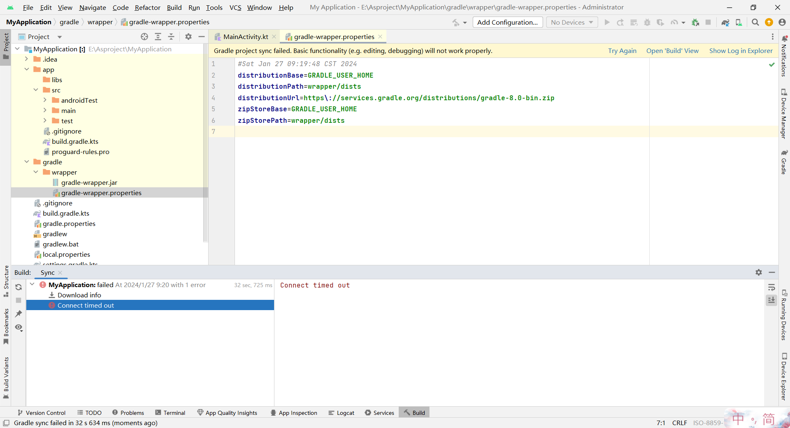
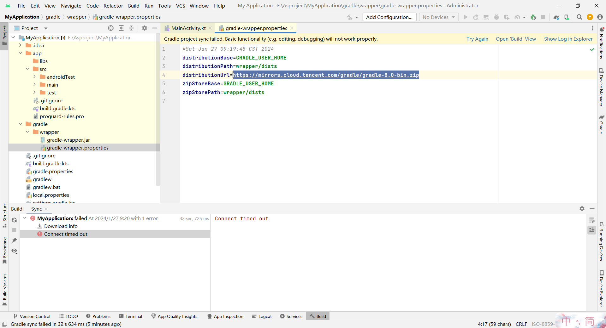
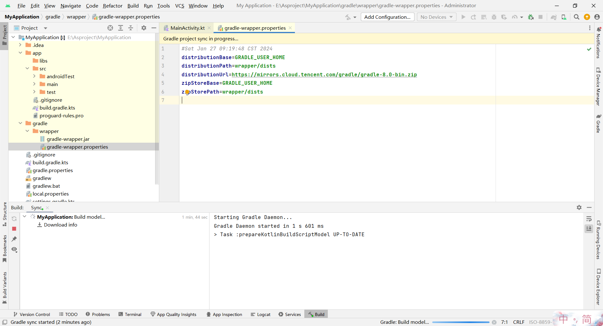

# Android Studio sync 失败解决方案

Android Studio新建项目的时候，会报一个`Gradle project sync failed.Basic functionality (e.g. editing, debugging) will not work properly.`这样的错误。如下图所示：



解决方案是对gradle换源

打开`gradle/wrapper/gradle-wrapper.properties`这个文件

把其中的`distributionUrl`这个字段换成镜像地址:

```plaintext
https://mirrors.cloud.tencent.com/gradle/gradle-8.0-bin.zip
```



然后try again就可以了，可以发现在正常下载


