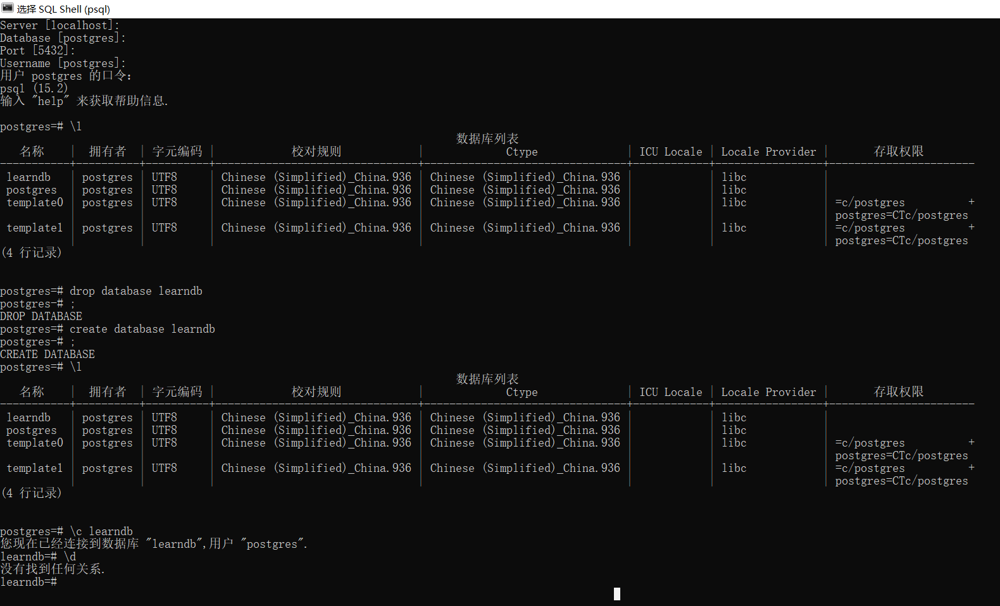

# SQL笔记

## PSQL操作

### 基本命令

```psql
\?		   帮助
\l		   列举数据库
\c DBNAME  连接到新数据库
\d         描述表，视图，序列，或索引
\dt        列出表
\q		   退出psgl
```

### 打开PSQL

如下，一路enter

```psql
Server [localhost]:
Database [postgres]:
Port [5432]:
Username [postgres]: # 在这里输密码就可以了
用户 postgres 的口令：
psql (15.2)
输入 "help" 来获取帮助信息.
```

### 基本操作

```psql
postgres=# \l

# 看下面的截图
(4 行记录)


postgres=# drop database learndb
postgres-# ;
DROP DATABASE
postgres=# create database learndb
postgres-# ;
CREATE DATABASE
postgres=# \l

# 看下面的截图
(4 行记录)


postgres=# \c learndb
您现在已经连接到数据库 "learndb",用户 "postgres".
learndb=# \d
没有找到任何关系
```

这个时候其实已经是可以在里面输入数据库查询语句了，不过这个是空数据库，查不到任何东西。

### 截图



### 关于`postgres=#`

- postgres:当前的数据库名
- =:当前是新语句
- -:如果不是`=`而是`-`的话，说明PSQL没有读到`;`，认为上一句还没有结束
- (:在图形化界面不是`-`而是`(`

### 创建表

```postgresql
learndb=# CREATE TABLE department(
learndb(#   dNo           CHAR(2)        NOT NULL UNIQUE,
learndb(#   dName         VARCHAR(20),
learndb(#   officeRoom    VARCHAR(40),
learndb(#   homePage      VARCHAR(80),
learndb(#   PRIMARY KEY(dNo)
learndb(# );
CREATE TABLE
```

也可以不在psql里面做这个事情，可以在postgreSQL专门的查询界面干这事

```postgresql
CREATE TABLE department(
  dNo           CHAR(2)        NOT NULL UNIQUE,
  dName         VARCHAR(20),
  officeRoom    VARCHAR(40),
  homePage      VARCHAR(80),
  PRIMARY KEY(dNo)
);

CREATE TABLE student(
  sNo 		CHAR(6)        NOT NULL UNIQUE,
  sName		VARCHAR(20)    NOT NULL,
  sex		CHAR(2)        CHECK (sex IN('男','女')),      
  age		INT,
  email         VARCHAR(50),
  dNo		CHAR(2),
  PRIMARY KEY(sNo),
  FOREIGN KEY (dNo) REFERENCES  department(dNo)
);

CREATE TABLE course(
  cNo		CHAR(6)	       NOT NULL UNIQUE,
  cName		VARCHAR(20)    NOT NULL,
  cPNo		CHAR(6),
  credit	INT,
  dNo           CHAR(2),
  PRIMARY KEY(cNo),
  FOREIGN KEY (cPNo) REFERENCES  course(cNo),
  FOREIGN KEY (dNo)  REFERENCES  department(dNo)
);

CREATE TABLE sc(
  sNo		CHAR(6)	       NOT NULL,
  cNo		CHAR(6)	       NOT NULL,
  score		INT,
  recordDate    date           DEFAULT current_date,
  PRIMARY KEY(sNo,cNo),
  FOREIGN KEY (sNo) REFERENCES  student(sNo),
  FOREIGN KEY (cNo) REFERENCES  course(cNo)
);
```

### 插入数据

```postgresql
INSERT INTO department VALUES('01','信息学院','行政楼409','www.xxx.edu.cn');
INSERT INTO department VALUES('02','软件学院',null,null);
INSERT INTO department VALUES('03','理学院',null,null);
INSERT INTO department VALUES('04','文学院',null,null);
INSERT INTO department VALUES('05','外国语学院',null,null);
/*
......
下面省略不写
*/
```

## 查询语句

### 基本格式

```sql
SELECT [DISTINCT|ALL]{*|[columnExpression[AS 
newName]][,…]}
FROM TableName[alias][,…]
[WHERE condition]
[GROUP BY columnList][HAVING condition]
[ORDER BY columnList]
```

### 简单操作

```postgresql
/*
这是多行注释
pgAdmin4的常用快捷键:
  - Ctrl+Shift+K:格式化
  - F5:运行
  - Alt+S:保存
*/
SELECT *
FROM STUDENT;-- 这是单行注释，注意双减号后面要有空格


SELECT SNO,
	SNAME
FROM STUDENT;-- 查询两个字段


SELECT SNAME,
	2023 - AGE AS X -- 用AS进行重命名
FROM STUDENT;


SELECT DISTINCT SNO -- DISTINCT代表多个重复结果只保留一个
FROM SC;


SELECT SNO
FROM STUDENT
WHERE AGE NOT BETWEEN 20 AND 23; -- 这里AGE后面可以用类似 <= 17 / IN(18,19,20)之类的筛选条件，sql中用`=`而不是`==`表示相等
```

### LIKE语句

```postgresql
/*LIKE*/
SELECT sNo,sName
FROM Student 
WHERE sName LIKE '张%'; -- `%`可以指代一个及以上的字符

SELECT sNo,sName
FROM Student 
WHERE sName LIKE '张_'; -- `_`可以指代一个字符

SELECT *
FROM Course
WHERE cName LIKE 'DB\_%i__' ESCAPE '\'; -- `ESCAPE`指出`\`是转义字符

SELECT *
FROM Student 
WHERE sName ~ '^[\u4E00-\u9FA5]{3,4}$'; -- `~`指出正则表达式
```

### NULL

`null`代表未知

```postgresql
/*NULL
NULL代表未知(注意不是""空字符串),意思是所有可能都存在

以下是SQL中WHERE语句可能返回的三种结果及其原因
- true:有返回数据
- false:无返回数据
- NULL(未知):此时也无返回数据
*/
SELECT * FROM SC WHERE 1=1; -- 有结果，因为1=1返回true
SELECT * FROM SC WHERE 1=0; -- 无结果，因为1=0返回false
SELECT * FROM SC WHERE 1=NULL; -- 无结果，因为SQL也不知道1是不是等于NULL(1=NULL返回NULL)
SELECT * FROM SC WHERE NULL=NULL; -- 无结果

-- NOT语句:false和null的区别
SELECT * FROM SC WHERE NOT(1=0); -- 有结果，因为SQL知道NOT false就是true
SELECT * FROM SC WHERE NOT NULL; -- 无结果， 而NOT(NULL)还是未知，说句题外话，NOT后面的东西只能是boolean值
SELECT * FROM SC WHERE NOT(1=NULL); -- 无结果，因为SQL也不知道1是不是等于NULL(true和false都有可能)

-- IS语句判断NULL
SELECT * FROM STUDENT WHERE AGE = NULL; -- 无结果
SELECT * FROM STUDENT WHERE AGE IS NULL; -- 有结果

-- IN语句
select * from student where 1 IN (1,2,NULL); -- 有结果，因为1确实在元组里面
select * from student where 1 IN (2,NULL); -- 无结果，因为1在不在元组里面是未知的
select * from student where NULL IN (1,2,NULL); -- 无结果，因为两个NULL虽然都是未知，但是是不同的
select * from student where 1 NOT IN (1,2,NULL); -- 无结果，因为1确实在元组里面
select * from student where 1 NOT IN (2,NULL); -- 无结果，因为1在不在元组里面是未知的

-- 比较
SELECT * FROM STUDENT WHERE AGE <> 18; -- AGE为null的人不被计入
```

### 排序

```postgresql
/*排序*/
SELECT SNO,
	SCORE
FROM SC
WHERE CNO = '010101'
ORDER BY SCORE DESC; -- DESC代表降序排列  ASC代表升序排列(默认ASC)

SELECT * 
FROM Student 
ORDER BY dNo, age DESC; -- dNo为第一关键字，升序；age为第二关键字，降序
-- 另外，null在升序排序结果中在最后，而在降序排序中在最前，所以可以将null视为最大值
```

## 聚合函数

聚合函数输入的是一组数据的集合，输出的是单个值

**注意**:聚合函数一般无视`null`

```postgresql
COUNT([DISTINCT|ALL] *)
COUNT([DISTINCT|ALL] <columnName>) 
SUM([DISTINCT|ALL] <columnName>) 
AVG([DISTINCT|ALL] < columnName >)
MAX([DISTINCT|ALL] < columnName >) 
MIN([DISTINCT|ALL] < columnName >)
```

### COUNT

```postgresql
/*聚合函数*/
-- COUNT
-- 你会发现COUNT可以对多维数组进行处理，但是其他很多聚合函数只能对一列进行处理
SELECT COUNT(*) -- 返回Student的列数
FROM Student;

SELECT COUNT(age) -- 返回Student中age的列数
FROM Student; -- 注意，由于聚合函数无视null，所以这个命令和上面那个命令的返回结果可能不同

SELECT COUNT(*) AS countOf -- 可以重命名结果
FROM Course
WHERE credit >= 2;

SELECT COUNT(DISTINCT sNo) -- 重复的不管
FROM SC;
```


### AVG

```postgresql
SELECT AVG(score) 
FROM SC 
WHERE cNo='010101'; -- 可以先进行筛选再聚合
```


其他`MIN` `MAX` `SUM`什么的都是类似的

### GROUP

类似合并单元格

先分组后聚合(null也会被分成一组)

```postgresql
-- HAVING
-- 满足HAVING 子句中条件的分组将被显示
SELECT sNo
FROM SC
WHERE score>60
GROUP BY sNo
HAVING COUNT(*)>3; -- 每个分组中有超过3行

SELECT sNo
FROM SC
WHERE score>60
GROUP BY sNo
HAVING sNo='170102'; -- having后面一般是用聚合函数的，这里可以用sNo是因为sNo是分组依据(GROUP BY sNo)
```

## 子查询

```postgresql
/*子查询*/
SELECT SNAME
FROM STUDENT
WHERE DNO =
		(SELECT DNO
			FROM STUDENT
			WHERE SNAME = '宁灿');
```

