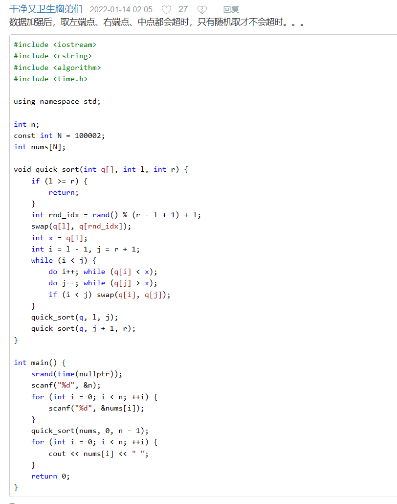
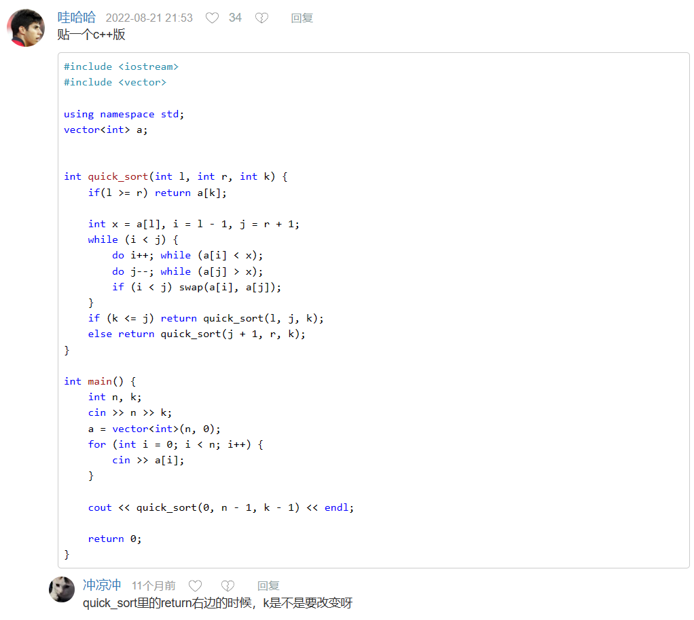
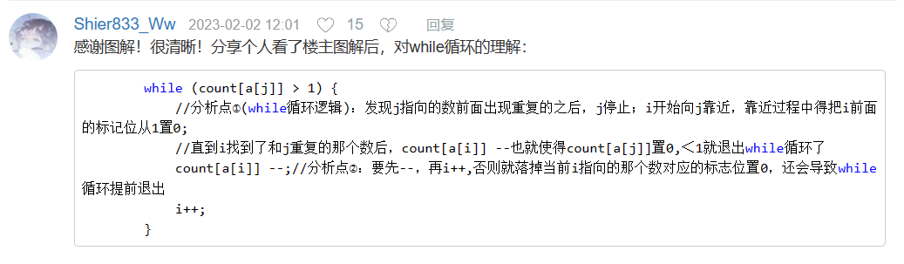
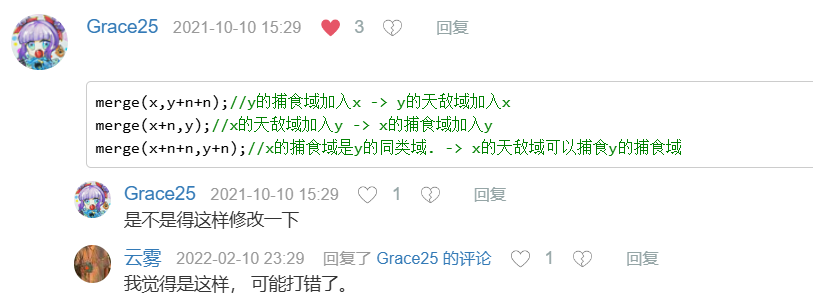
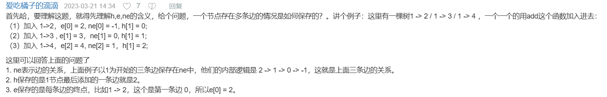
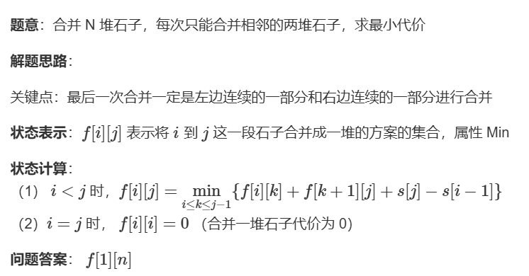

# 算法笔记

跟着[活动 - AcWing](https://www.acwing.com/activity/content/11/)来

## 基础算法

### 快速排序

理解：[快速排序（图解+C代码） - 知乎 (zhihu.com)](https://zhuanlan.zhihu.com/p/350934702)

自己手搓的c语言实现：

```c
#include<stdio.h>

void q_sort(int*nums,int begin,int end) {
    if (begin >= end) {
        return;
    }

    int base = nums[begin];
    int orgin_begin = begin;
    int orgin_end = end;
    int flag = 1;
    while (end>begin)
    {
        if (flag) {
            if (nums[end] < base) {
                flag = 0;
                continue;
            }
            end--;
        }
        else {
            

            if (nums[begin] > base) {
                flag = 1;
                int tmp = nums[begin];
                nums[begin] = nums[end];
                nums[end] = tmp;
                continue;
            }
            begin++;
        }
    }
    int tmp = nums[begin];
    nums[begin] = base;
    nums[orgin_begin] = tmp;
    q_sort(nums, orgin_begin, begin - 1);
    q_sort(nums, begin + 1, orgin_end);
}

int main() {
    int n;
    scanf("%d",&n);
    int *num = (int*)malloc(sizeof(int)*n); 
    for (int i = 0; i < n; i++) {
        scanf("%d", num + i);
    }

    q_sort(num,0,n-1);//注意这里要是n-1

    for (int i = 0; i < n; i++) {
        printf("%d ", num[i]);
    }
    return 0;
}
```

人工智能写的：

```c++
#include <iostream>  
using namespace std;  
  
int partition(int* nums, int begin, int end) {  
    int pivot = nums[begin]; // 选择第一个元素作为基准  
    int i = begin + 1, j = end;  
    while (true) {  
        while (i <= j && nums[i] < pivot) i++;  
        while (i <= j && nums[j] > pivot) j--;  
        if (i >= j) break;  
        swap(nums[i++], nums[j--]);  
    }  
    swap(nums[begin], nums[j]); // 将基准值放到正确的位置  
    return j; // 返回基准值的索引  
}  
  
void q_sort(int* nums, int begin, int end) {  
    if (begin < end) {  
        int pivot_index = partition(nums, begin, end); // 获取基准值的索引  
        q_sort(nums, begin, pivot_index - 1); // 对基准值左边的部分进行递归排序  
        q_sort(nums, pivot_index + 1, end); // 对基准值右边的部分进行递归排序  
    }  
}  
  
// main 函数保持不变...
```



### 第K小的数

这老哥的方法无敌

[AcWing 786. 写一个和yxc大佬不同但差不多思想的方法，代码更简单 - AcWing](https://www.acwing.com/solution/content/4502/)



### 归并排序

看这个 [AcWing 787- AcWing](https://www.acwing.com/solution/content/138050/)

感觉非常清楚了

```c++
#include <iostream>
using namespace std;
const int N = 100010;
int n;
int a[N],tmp[N];
void merge (int a[],int l,int mid,int r) {
    int k = 1,i = l,j = mid+1;
    while (i <= mid && j <= r) {
        if (a[i] <= a[j]) tmp[k++] = a[i++];
        else tmp[k++] = a[j++];
    }
    while (i <= mid) tmp[k++] = a[i++];
    while (j <= r) tmp[k++] = a[j++];
    for (i = l,j = 1;i <= r;i++,j++) a[i] = tmp[j];
}
void mergeSort (int a[],int l,int r) {
    if (l >= r) return ;
    int mid = l + r >> 1;
    mergeSort (a,l,mid);
    mergeSort (a,mid + 1,r);
    merge (a,l,mid,r);
}
int main () {
    cin >> n;
    for (int i = 1;i <= n;i++) cin >> a[i];
    mergeSort (a,1,n);
    for (int i = 1;i <= n;i++) cout << a[i] << ' ';
    return 0;
}

```

### 逆序对的数量

[788. 逆序对的数量 - AcWing题库](https://www.acwing.com/problem/content/790/)

```c++
#include <algorithm>
#include <vector>
#include <iostream>
using namespace std;

long long  cnt = 0;
vector<int>::iterator it;

void func(vector<int>& nums, int be, int end) {
    // 处理范围:[be,end-1]
    if (be >= end-1) return;
    // 分解为子问题
    int mid = (be+end) / 2;

    // 解决子问题
    func(nums, be, mid);
    func(nums, mid, end);
    // 合并解
    int i = be, j = mid;
    while (i < mid && j < end) {
        if (nums[i] <= nums[j]) {
            i++;
        }
        else {
            // 逆序情况
            j++;
            cnt = cnt + mid - i;
        }
    }
    sort(it + be, it + end);
}

int main() {
    int n;
    cin >> n;
    vector<int> nums(n);
    for (int i = 0; i < n; i++) {
        cin >> nums[i];
    }
    it = nums.begin();

    func(nums, 0, n);

    cout << cnt;
    return 0;
}
```

这里要注意的是把一个列表传给函数，要注意是要传引用而不是传赋值。

还有就是`cnt`这种东西还是用`long long`的好

### 数的范围

https://www.acwing.com/activity/content/problem/content/823/

算是自己写出来了

```c++
#include<iostream>
#include<algorithm>
#include<map>

using namespace std;

int main(){
    int n,q;
    scanf("%d %d",&n,&q);
    map<int,int> map_begin;
    map<int,int> map_end;
    int last=-1;
    int now =0;
    for(int i=0;i<n;i++){
        scanf("%d",&now);
        if(!i){
            last=now;
            map_begin[now]=i;
            
            continue;
        }
        if(last == now){
            continue;
        }else{
            map_end[last]=i-1;
            last=now;
            map_begin[now]=i;//map_begin.insert(now,i);
        }

    }
    map_end[last]=n-1;
    int* query=(int* )malloc(sizeof(int)*q);
    for(int i=0;i<q;i++){
        scanf("%d",&query[i]);
        
    }
    for(int i=0;i<q;i++){
        auto it_begin=map_begin.find(query[i]);
        if(it_begin==map_begin.end()){
            printf("-1 -1\n");
            continue;
        }
        printf("%d %d\n",map_begin[query[i]],map_end[query[i]]);
    }
    
    
    return 0;
}
```

### 高精度加法

我是天才

```c++
#include<iostream>
#include<algorithm>
#include<string>
#include<list>

using namespace std;


int main(){
    
    string s1;
    string s2;

    cin >> s1;
    cin>>s2;
    if(s1.length()>s2.length()) swap(s1,s2);
    int flag=0;
    string s3;
    reverse(s1.begin(),s1.end());
    reverse(s2.begin(),s2.end());
    for(int i=0;i<s1.length();i++){
        char c1=s1[i];
        char c2=s2[i];
        int i1=int(c1)-'0';
        int i2=int(c2)-'0';
        int i3=(i1+i2+flag)%10;
        flag=(i1+i2+flag)/10;
        char c3=char(i3+'0');
        s3.push_back(c3);
    }
    for(int i=s1.length();i<s2.length();i++){
        int i1=0;
        char c2=s2[i];
        int i2=int(c2)-'0';
        int i3=(i1+i2+flag)%10;
        flag=(i1+i2+flag)/10;
        char c3=char(i3+'0');
        s3.push_back(c3);
    }
    if(flag) s3.push_back('1');
    reverse(s3.begin(),s3.end());
    cout<<s3;
    return 0;
}
```

就是这个'0'的加减有点没适应过来

### 前缀和

[AcWing 795. 前缀和 【c++详细题解】 - AcWing](https://www.acwing.com/solution/content/27238/)

### 差分

```c++
#include<iostream>
#include<algorithm>
#include<string>
#include<list>

using namespace std;

int num[100000];
int res[100000];//res[i]=num[i]-num[i-1]

int main(){
    int n,m;
    cin>>n>>m;
    
    for(int i=1;i<=n;i++){
        scanf("%d",&num[i]);
        res[i]=num[i]-num[i-1];
        
    }
    int l,r,c;
    for(int i=0;i<m;i++){
        scanf("%d %d %d",&l,&r,&c);
        res[l]+=c;
        res[r+1]-=c;
    }
    for(int i=1;i<=n;i++){
        num[i]=res[i]+num[i-1];
        printf("%d ",num[i]);
    }
    return 0;
}
```

i从1开始这点挺妙的

### 差分矩阵

[AcWing 798. 差分矩阵 【 c++详细题解 】 - AcWing](https://www.acwing.com/solution/content/27325/)

这个解答的图示做的非常好

### 最长不重复子序列

[AcWing 799. 画个简图辅助理解 - AcWing](https://www.acwing.com/solution/content/13491/)



```c++
#include<iostream>
using namespace std;
#include<vector>
int v[100002];
int f[100002];//频率记录

int main() {
    int n;
    std::cin >> n;
    int ans=0;
    for (int i = 0,j=0; i < n; i++) {
        cin >> v[i];
        f[v[i]]++;//频率+1
        while (f[v[i]] > 1) {//有重复
            f[v[j]]--;//前面的指针向后移动 直到排除这个重复元素
            j++;
        }
        ans = max(ans, i - j + 1);
    }
    cout << ans;
    
    return 0;
}
```

这里要注意的是f这个东西的大小必须大于v[i]的大小，而不是大于n的大小

### 数组元素的目标和

[800. 数组元素的目标和 - AcWing题库](https://www.acwing.com/problem/content/802/)

```c++
#include <algorithm>
#include <vector>
#include <iostream>
using namespace std;

int main() {
    int n, m, x;
    cin >> n >> m >> x;
    vector<int> A(n), B(m);
    for (int i = 0; i < n; i++) {
        cin >> A[i];
    }
    for (int j = 0; j < m; j++) {
        cin >> B[j];
    }
    int i = 0, j = m-1;
    while (A[i] + B[j] != x) {
        if (A[i] + B[j] > x) j--;
        if (A[i] + B[j] < x) i++;
    }
    cout << i << ' ' << j;
    return 0;
}
```

双指针算法，不难

### 计算二进制中1的数量

https://www.acwing.com/solution/content/2370/

```c++
#include<iostream>
#include<algorithm>
#include<string>
#include<list>

using namespace std;

int lowbits(int num){
    // 找出最后一个1及其后面的数
    return num&(-num);
}


int main(){
    int n,t;
    cin>>n;
    for(int i=0;i<n;i++){
        cin>>t;
        int cnt_1=0;
        while(t) {t-=lowbits(t);cnt_1++;}
        cout<<cnt_1<<' ';
    }
    return 0;
}
```

### 区间合并

[803. 区间合并 - AcWing题库](https://www.acwing.com/problem/content/805/)

```c++
#include <algorithm>
#include <vector>
#include <iostream>
#include<queue>
using namespace std;

priority_queue < pair<int, int>, vector<pair<int, int>>, greater<pair<int, int>>> pqii;
int main() {
    int n;
    cin >> n;
    for (int i = 0; i < n; i++) {
        int l, r;
        cin >> l >> r;
        pqii.push({l, r});
    }
    int cnt = 0;
    int last_r = -1e9 - 2;
    while (!pqii.empty()) {
        int l=pqii.top().first;
        int r = pqii.top().second;
        pqii.pop();
        if (last_r < l) {
            cnt += 1;
            last_r = r;
        }
        else {
            last_r = max(last_r, r);
        }
    }
    cout << cnt;
    return 0;
}
```

## 数据结构

### 单调栈

[830. 单调栈 - AcWing题库](https://www.acwing.com/problem/content/832/)

```c++
// 这题的关键是建立一个上大下小的栈
#include<iostream>
#include<stack>
using namespace std;

int main() {
	int n; 
	cin >> n;
	stack<int> stk;
	for (int i = 0; i < n; i += 1) {
		int j = -1;
		cin >> j;
		while (!stk.empty()) {
			if (j > stk.top()) {
				// 比栈顶更大则加入
				cout << stk.top() << ' ';
				stk.push(j);
				break;
			}
			else {
				// 比栈顶更小则出栈保证栈顶大于栈底
				stk.pop();
			}
		}
		if (stk.empty()) {
			cout << -1 << ' ';
			stk.push(j);
			continue;
		}
	}
	return 0;
}
```

### 单调队列

[AcWing 154. 滑动窗口---海绵宝宝来喽 - AcWing](https://www.acwing.com/solution/content/97229/)

这里用队列的原因是为了某个元素被滑动窗口滑出后，还能找到下一个候选元素

```c++
#include<iostream>
#include<deque>
#include<vector>
using namespace std;

int main() {
	int n,k; 
	cin >> n >> k;
	deque<int> qmax, qmin;
	vector<int> v(n);
	for (int i = 0; i < n; i += 1) {
		cin >> v[i];
	}
	// 处理最小值
	// 初始化为一个单调递增的队列 即队头小于队尾
	for (int i = 0; i < k; i++) {
		while (!qmin.empty() && v[i] < qmin.back()) {
			qmin.pop_back();
		}
		// 此时新元素小于队尾或者队列为空
		qmin.push_back(v[i]);
	}
	for (int i = k; i < n; i += 1) {
		cout << qmin.front() << ' ';
		if (qmin.front() == v[i - k]) qmin.pop_front();//该移出了

		while (!qmin.empty() && v[i] < qmin.back()) {
			qmin.pop_back();
		}
		// 此时新元素小于队尾或者队列为空
		qmin.push_back(v[i]);
	}
	// 输出最后一个
	cout << qmin.front() << endl;


	// 处理最大值
	// 初始化为一个单调递减的队列 即队头大于队尾
	for (int i = 0; i < k; i++) {
		while (!qmax.empty() && v[i] > qmax.back()) {
			qmax.pop_back();
		}
		// 此时新元素大于队尾或者队列为空
		qmax.push_back(v[i]);
	}
	for (int i = k; i < n; i += 1) {
		cout << qmax.front() << ' ';
		if(qmax.front() == v[i-k]) qmax.pop_front();//该移出了

		while (!qmax.empty() && v[i] > qmax.back()) {
			qmax.pop_back();
		}
		// 此时新元素大于队尾或者队列为空
		qmax.push_back(v[i]);
	}
	// 输出最后一个
	cout << qmax.front() << ' ';
	return 0;
}
```

### Trie字符串统计

[835. Trie字符串统计 - AcWing题库](https://www.acwing.com/problem/content/837/)

就当学习一下unordered_map的使用了

```c++
#include <iostream>
#include <unordered_map>
#include <string>

using namespace std;

int main() {
    int N;
    cin >> N;

    unordered_map<string, int> string_count;

    for (int i = 0; i < N; ++i) {
        string operation, str;
        cin >> operation >> str;

        if (operation == "I") {
            string_count[str]++;
        } else if (operation == "Q") {
            cout << string_count[str] << endl;
        }
    }

    return 0;
}

```

### 最大异或对

[143. 最大异或对 - AcWing题库](https://www.acwing.com/problem/content/145/)

为了得到两个整数的异或结果最大值，我们可以使用一种基于字典树（Trie）的算法。具体步骤如下：

1. 初始化一个空的字典树（Trie），每个节点可以有两个子节点，分别代表下一位是0或者1。
2. 遍历所有给定的整数，将它们转换成二进制形式，并将每个整数的二进制表示插入到字典树中。插入的时候，从最高位（二进制的最左边）开始，依次向下创建或遍历节点。
3. 再次遍历所有给定的整数，对于每个整数，在字典树中查找一个路径，使得该路径上每一位尽可能与该整数的对应位不同（因为异或运算中，相同位异或结果为0，不同位异或结果为1，所以为了得到最大值，我们希望尽可能找到不同的位）。这样我们就能得到该整数与字典树中某个数异或的最大值。
4. 在遍历所有整数并计算每个整数可能得到的最大异或值之后，选择其中的最大值作为答案。

```c++
#include <iostream>  
#include <vector>  
  
using namespace std;  
  
class TrieNode {  
public:  
    TrieNode* children[2];  
  
    TrieNode() {  
        children[0] = NULL;  
        children[1] = NULL;  
    }  
};  
  
class Trie {  
private:  
    TrieNode* root;  
  
    void insert(TrieNode* root, int num) {  
        TrieNode* node = root;  
  
        for (int i = 31; i >= 0; --i) {  
            int bit = (num >> i) & 1;  
            if (node->children[bit] == NULL) {  
                node->children[bit] = new TrieNode();  
            }  
            node = node->children[bit];  
        }  
    }  
  
    int findMaximumXOR(TrieNode* root, int num) {  
        TrieNode* node = root;  
        int xorResult = 0;  
  
        for (int i = 31; i >= 0; --i) {  
            int bit = (num >> i) & 1;  
            int oppositeBit = 1 - bit;  
  
            if (node->children[oppositeBit] != NULL) {  
                xorResult |= (1 << i);  
                node = node->children[oppositeBit];  
            } else {  
                node = node->children[bit];  
            }  
        }  
  
        return xorResult;  
    }  
  
public:  
    Trie() {  
        root = new TrieNode();  
    }  
  
    void insert(int num) {  
        insert(root, num);  
    }  
  
    int findMaximumXORHelper(vector<int>& nums) {  
        int maxXOR = 0;  
        for (int num : nums) {  
            insert(num);  
            int currentXOR = findMaximumXOR(root, num);  
            maxXOR = max(maxXOR, currentXOR);  
        }  
        return maxXOR;  
    }  
};  
  
int findMaximumXOR(vector<int>& nums) {  
    Trie trie;  
    return trie.findMaximumXORHelper(nums);  
}  
  
int main() {  
    int N;  
    cin >> N;  
    vector<int> nums(N);  
    for (int i = 0; i < N; ++i) {  
        cin >> nums[i];  
    }  
  
    cout << findMaximumXOR(nums) << endl;  
    return 0;  
}
```

### 合并集合

并查集

```c++
#include <iostream>  
#include <vector>  
#include<time.h>
using namespace std;

int num[100002];//0这个节点保留不用 故当num[i]==0 i节点为根

// 找到对应节点的根
int find(int i) {
    int j=i;
    while (num[j]) {
        j = num[j];
    }
    // 找到根节点后进行路径优化
    while (num[i]&&num[i]!=j) {//num[i]为0就不用优化了
        int next = num[i];
        num[i] = j;
        i = next;
    }
    return j;
}

int main() {
    int n, m;
    cin >> n >> m;
    char oper;
    int a, b;
    for (int i = 0; i < m; i++) {
        cin >> oper >> a >> b;
        int root_a = find(a);
        int root_b = find(b);
        if (oper == 'M') {
            if (root_b != root_a) {
                num[root_b] = root_a;
            }
        }
        else
        {
            if (root_a != root_b) cout << "No"<<endl;
            else cout << "Yes" << endl;
        }
    }
    return 0;
}
```

[AcWing 836. 并查集(保姆级讲解) - AcWing](https://www.acwing.com/solution/content/20690/)

这是另外一种设计方法，当`num[id]==id`时代表该节点为根，它的优化方法比我的妙一点，用了递归

```c++
#include<iostream>

using namespace std;

const int N=100010;
int p[N];//定义多个集合

int find(int x)
{
    if(p[x]!=x) p[x]=find(p[x]);
    /*
    经上述可以发现,每个集合中只有祖宗节点的p[x]值等于他自己,即:
    p[x]=x;
    */
    return p[x];
    //找到了便返回祖宗节点的值
}

int main()
{
    int n,m;
    scanf("%d%d",&n,&m);
    for(int i=1;i<=n;i++) p[i]=i;
    while(m--)
    {
        char op[2];
        int a,b;
        scanf("%s%d%d",op,&a,&b);
        if(*op=='M') p[find(a)]=find(b);//集合合并操作
        else
        if(find(a)==find(b))
        //如果祖宗节点一样,就输出yes
        printf("Yes\n");
        else
        printf("No\n");
    }
    return 0;
}

```

### 连通块中点的数量

[837. 连通块中点的数量 - AcWing题库](https://www.acwing.com/problem/content/839/)

和上面题目类似，就是可以选择将根节点的`num[id]`设置为`size`

### 食物链

带权并查集

[AcWing 240. 食物链 - AcWing](https://www.acwing.com/solution/content/1007/)

需要按下面的评论改一下：



### 模拟散列表

[840. 模拟散列表 - AcWing题库](https://www.acwing.com/problem/content/842/)

就当是练练stl了

```c++
#include <iostream>
#include <unordered_set>

using namespace std;


int main() {
    int N;
    cin >> N;
    unordered_set<int> us;
    for (int i = 0; i < N; i++) {
        int x;
        char o;
        cin >> o >> x;
        if (o == 'I') {
            us.insert(x);
        }
        else {
            if (us.find(x) != us.end()) {
                cout << "Yes" << endl;
            }
            else {
                cout << "No" << endl;
            }
        }
    }

    return 0;
}

```

### 字符串哈希

[AcWing 841. 字符串哈希 【公式助理解】 - AcWing](https://www.acwing.com/solution/content/24738/)

设计hash函数，通过将字符串中的每个字符转成数字来将整个字符串转成p进制

再用$mod\ 2^{64}$的方法，如果超过了`unsigned long long`的范围，相当于取模了，非常巧妙

也用了前缀和的方法来计算子串和

## 搜索与图论

### DFS

[842. 排列数字 - AcWing题库](https://www.acwing.com/problem/content/844/)

这是一个排列树问题，是通过交换实现的遍历

```c++
#include <iostream>
#include <vector>

using namespace std;

void backtrack(vector<int> vi, int l) {//l:已经确定l位
    if (l == vi.size()) {
        for (int i = 0; i < l; i += 1) {
            cout << vi[i] << ' ';
        }cout << endl;
        return;
    }
    for (int i = l; i < vi.size(); i += 1) {
        swap(vi[l],vi[i]);
        backtrack(vi, l + 1);
        //swap(vi[l], vi[i]);//这里交换了就不是字典序了
    }
}

int main() {
    int n;
    cin >> n;
    vector<int> vi(n);
    for (int i = 0; i < n; i += 1) {
        vi[i] = i+1;
    }
    backtrack(vi, 0);
    return 0;
}

```

说实话，我也不是很懂为什么回溯的结束交换一下就不是字典序了，不交换就正确了，**所以最好不要用**

但是可以看下面这种解法

```python
def dfs(path, visited, n):  
    if len(path) == n:  
        print(' '.join(map(str, path)))  
        return  
    for i in range(1, n + 1):  
        if not visited[i]:  
            visited[i] = True  
            path.append(i)  
            dfs(path, visited, n)  
            path.pop()  
            visited[i] = False  
  
n = int(input())  
visited = [False] * (n + 1)  
dfs([], visited, n)
```

可以用一个标志位来实现正确的遍历

### n皇后问题

[843. n-皇后问题 - AcWing题库](https://www.acwing.com/problem/content/description/845/)

```c++
#include <iostream>
#include <vector>
#include <unordered_set>

using namespace std;
int vi[100002];
int n;
bool check(int now) {//now is new to the solution
    //任意两个皇后都不能处于同一行、同一列或同一斜线上
    int r=now, c=vi[now];
    for (int i = 0; i < now; i++) {
        if (vi[i] == c) {
            return false;
        }
        if (abs(i - r) == abs(c - vi[i])) {
            return false;
        }
    }
    return true;
}

void backtrack(int vi[], int l) {//0->l-1 is selected
    if (l == n) {
        for (int i = 0; i < l; i += 1) {
            for (int j = 0; j < l; j++) {
                if (j == vi[i]) cout << "Q";
                else cout << ".";
            }cout << endl;
        }cout << endl;
        return;
    }
    for (int i = l; i < n; i += 1) {
        swap(vi[l],vi[i]);
        if(check(l)) backtrack(vi, l + 1);
        swap(vi[l], vi[i]);//这里一定要恢复现场
    }
}

int main() {
    cin >> n;
    for (int i = 0; i < n; i += 1) {
        vi[i] = i;
    }
    backtrack(vi, 0);
    return 0;
}

```

总结：尽量用恢复现场的方法，如果dfs要求字典序，则要用一个标志数组来记录有没有遍历对应的位置

### 走迷宫

[AcWing 844. 走迷宫：图解+代码注释 - AcWing](https://www.acwing.com/solution/content/36520/)

这个解法对于四个走的方向的处理还是很妙的，使用了dx和dy两个4维数组存储四个方向的移动值来方便查询4个移动方向

最先走到终点的一定是最短路径，当然这题在记录层数的时候可以放一个-1在队列里面

### 八数码

[AcWing 845. 八数码 - AcWing](https://www.acwing.com/solution/content/15149/)

这个存状态有没有走过使用了字符串，感觉是比较妙的点

### 树的重心

这个感觉非常搞

大致思路：[AcWing 846. 树的重心 - AcWing](https://www.acwing.com/solution/content/4917/)

关于代码中的sum/res/ans的意义：[AcWing 846. 树的重心(把这道题研究成灰的题解) - AcWing](https://www.acwing.com/solution/content/117855/)

本题使用了树的邻接表表示方法，但不是用链表实现的

插入（头插法）：

```c++
const int N = 1e5 + 10; //数据范围是10的5次方
//邻接表
int h[N], e[N * 2], ne[N * 2], idx;//h数组的大小是节点数 e/ne的大小是边数

void add(int a, int b) {
    e[idx] = b;
    ne[idx] = h[a];
    h[a] = idx++;
}

int main(){
    memset(h, -1, sizeof h); //初始化h数组 -1表示尾节点
    cin >> n; //表示树的结点数

    for (int i = 0; i < n - 1; i++) {
        int a, b;
        cin >> a >> b;
        add(a, b), add(b, a); //无向图
    }
    return 0;
}
```

[遍历](https://www.acwing.com/solution/content/104791/)：

```c++
for(int i=1;i<=n;i++)  
{
    cout<<i<<":";
    for(int j=h[i];j!=-1;j=ne[j])
    {
        cout<<"->"<<e[j]; 
    }
    cout<<endl;
}
/*
1:->4->7->2
2:->5->8->1
3:->9->4
4:->6->3->1
5:->2
6:->4
7:->1
8:->2
9:->3
*/
```

关于h,e,ne讲的还算清楚的一个：



### 有向图的拓扑序列

超时了，所以说不要自己手搓类

```c++
#include <iostream>
#include <queue>
#include <unordered_map>
#include<set>
#include <string>
using namespace std;

class point {
public:
    static int cout;
    static set<int> zero_in;
    int id;
    set<int> in;
    set<int> out;
    point() {
        id = cout++;
        if(id)zero_in.insert(id);
    }
    void remove(int id) {
        in.erase(id);
        if (in.empty()) {
            zero_in.insert(this->id);
        }
    }
}; int point::cout = 0;
set<int> point:: zero_in=set<int>();

int main() {
    
    int n, m;
    cin >> n >> m;
    string result;
    //point* p = new point[n];
    vector<point> p(n+1);
    set<int> res;
    for (int i = 1; i <= n; i++) {
        res.insert(i);
    }
    for (int i = 0; i < m; i++) {
        int a, b;
        cin >> a >> b;
        p[a].out.insert(b);
        point::zero_in.erase(b);
        p[b].in.insert(a);
    }
    while (point::zero_in.size()) {
        int pi = *(point::zero_in.begin());
        point::zero_in.erase(pi);
        res.erase(pi);
        for (auto i = p[pi].out.begin(); i != p[pi].out.end(); i++) {
            p[*i].remove(pi);
        }
        result = result + to_string(pi)+' ';

    }
    if (res.size()) cout << -1;
    else cout << result;
    return 0;
}

```

### 有边数限制的最短路(Bellman_ford)

[AcWing 853. 有边数限制的最短路 - AcWing](https://www.acwing.com/solution/content/6320/)

Dijkstra算法不能用在有负权重的边中

### SPFA算法

在Bellman_ford的基础上只选择一部分点进行更新

[AcWing 851. SPFA算法 - AcWing](https://www.acwing.com/solution/content/9306/)

> Bellman-ford可以处理任意带负权边和负权环的图，SPFA可以处理带负权边的图，Dijkstra只能处理带正权边的图；当然，从时间复杂度的效率来讲，是反过来的

### spfa判断负环

[AcWing 852. spfa判断负环 - AcWing](https://www.acwing.com/solution/content/6336/)

### floyd算法

[AcWing 854. Floyd求最短路 - AcWing](https://www.acwing.com/solution/content/6976/)：这个链接还有各种求最短路径方法的总结

其中代码如下：

```c++
#include <iostream>
using namespace std;

const int N = 210, M = 2e+10, INF = 1e9;

int n, m, k, x, y, z;
int d[N][N];

void floyd() {
    for(int k = 1; k <= n; k++)
        for(int i = 1; i <= n; i++)
            for(int j = 1; j <= n; j++)
                d[i][j] = min(d[i][j], d[i][k] + d[k][j]);
}

int main() {
    cin >> n >> m >> k;
    for(int i = 1; i <= n; i++)
        for(int j = 1; j <= n; j++)
            if(i == j) d[i][j] = 0;
            else d[i][j] = INF;
    while(m--) {
        cin >> x >> y >> z;
        d[x][y] = min(d[x][y], z);
        //注意保存最小的边
    }
    floyd();
    while(k--) {
        cin >> x >> y;
        if(d[x][y] > INF/2) puts("impossible");
        //由于有负权边存在所以约大过INF/2也很合理
        else cout << d[x][y] << endl;
    }
    return 0;
}
```

`if(d[x][y] > INF/2) puts("impossible");`：个人理解这行是因为有负权重才设置为这样的条件的，如果不是负权重则`d[x][y] == INF`就行

### Prim算法

[AcWing 858. Prim算法求最小生成树(堆优化写法) - AcWing](https://www.acwing.com/solution/content/8022/)

```c++
#include <iostream>
#include <queue>
#include <cstring>

using namespace std;
const int N = 502;
const int M = 2 * 1e5 + 10;
int flag[N];
int e[M],ne[M], h[M],w[M],idx;
int ans;
void add(int a, int b, int x) {
    e[idx] = b;
    w[idx] = x;
    ne[idx] = h[a];
    h[a] = idx++;
}
int main() {
    memset(h, -1, sizeof h); //初始化h数组 -1表示尾节点
    memset(flag, false, sizeof flag); //初始化h数组 -1表示尾节点
    typedef pair<int, int> PII;//堆里存储距离和节点编号
    priority_queue<pair<int, int>, vector<pair<int, int>>, greater<pair<int, int>>> heap;//小根堆

    int n, m;
    cin >> n >> m;
    for (int i = 0; i < m; i++) {
        int u, v, x;
        cin >> u >> v >> x;
        if (u == v)continue;
        add(u, v, x);
        add(v, u, x);
    }
    int cnt = 0;
    heap.push({ 0,1 });
    
    while (heap.size()) {
        int x = heap.top().first;
        int p = heap.top().second;
        heap.pop();
        if (flag[p]) continue;
        flag[p] = true;
        ans += x;
        cnt++;
        for (int i = h[p]; i != -1; i = ne[i]) {
            int j = e[i];
            if (!flag[j]) heap.push({ w[i], j });
        }
    }
    if (cnt == n) cout << ans;
    else cout << "impossible";
    return 0;
}

```

他说的对，上面这种写法确实有点重复：


### Kruskal算法

[AcWing 859. Kruskal算法求最小生成树---海绵宝宝来喽 - AcWing](https://www.acwing.com/solution/content/104383/)

使用并查集实现

### 染色法判定二分图

[AcWing 860. 染色法判定二分图---详细代码注释+图解 - AcWing](https://www.acwing.com/solution/content/105874/)

这个比较妙的一个点是它把点的颜色和是否遍历过这个点放在同一个数组进行存储

### 匈牙利算法

[AcWing 861. 二分图的最大匹配 - AcWing](https://www.acwing.com/solution/content/5334/)

## 数学知识

### 分解质因数

这个需要把重复的子问题存起来：如将已经判定是质数的数字存到一个数组，等这个数组不够大了再扩充

```c++
#include <iostream>
#include <queue>
#include <cstring>
#include<math.h>
using namespace std;

//  判断是否为质数
bool isPrime(int m) {
    if (m == 1)return false;
    int t = sqrt(m)+1;
    for (int i = 2; i < t; i++) {
        if ((!(m % i))&&m!=i) {
            return false;
        }
    }
    return true;
}

vector<int> ps = {2,3,5};//质数数组

int main() {
    int n,m;
    cin >> n;
    for (int i = 0; i < n; i++) {
        cin >> m;
        // 当前已经遍历到质数数组的第j个
        int j = 0;
        while (m != 1) {
            int cnt = 0;
            if (j == ps.size()) {
                // 遍历到最后一个了 需要扩充
                int k = ps[ps.size() - 1]+1;
                while (!isPrime(k)) {
                    k++;
                }
                ps.push_back(k);
                //cout << "扩充质数队列" << k << endl;
                if (k > sqrt(m) + 1) {
                    // 这个后面说
                    cout << m << ' ' << 1<< endl;
                    break;
                }
            }
            while(!(m % ps[j])) {
                // 约分
                if (!cnt) {
                    cout << ps[j] << ' ';
                }
                cnt++;
                //cout << "除以一次" << ps[j] << endl;
                m /= ps[j];
            }
            if (cnt) {
                // 该质数已经分析完毕 需要开始分析下一个质数
                cout << cnt << endl;
            }
            // 下一个
            j++;
        }
        cout << endl;
    }
    return 0;
}

```

关于这一步的添加：

```c++
if (k > sqrt(m) + 1) {
    // 这个后面说
    cout << m << ' ' << 1<< endl;
    break;
}
```

遇到1389338897=23*60406039这种

我的算法需要一直扩充到60406039才能确定60406039是一个质数，然后再输出

事实上只要扩充到sqrt(60406039)就可以确定60406039是一个质数了，直接输出就行了，注意此时的m不需要加入质数队列

### 筛质数

[AcWing 868. 筛质数 - AcWing](https://www.acwing.com/solution/content/2559/)

我的代码(应该不是最快的)：

```c++
#include <iostream>
#include<math.h>
using namespace std;
vector<int> ps = {};

bool isPrime(int m) {
    if(ps.empty()){
        // 需要初始化质数队列
        if (m == 1)return false;
        int t = sqrt(m)+1;
        for (int i = 2; i < t; i++) {
            if ((!(m % i))&&m!=i) {
                return false;
            }
        }
        return true;
    }
    else {
        // 迭代质数队列
        for (int i = 0; i < ps.size(); i++) {
            int t = ps[i];
            if (t > sqrt(m) + 1) {
                // 已知的质数无法整除m 说明m是质数
                return true;
            }
            else {
                if (m % t == 0) {
                    // m是合数
                    return false;
                }
            }
        }
        return true;
    }
}

int main() {
    int n;
    cin >> n;
    int cnt = 0;
    for (int i = 1; i <= n; i++) {
        if (isPrime(i)) {
            cnt++;
            ps.push_back(i);
        }
    }
    cout << cnt;
    return 0;
}

```

### 试除法求约数

[AcWing 869. 试除法求约数--海绵宝宝来喽 - AcWing](https://www.acwing.com/solution/content/148960/)

set用多了，看啥都想用set来排序，事实上也可以先搞一个vector再最后排序(理论上这两种方法的复杂度是一样的)

### 约数个数

[AcWing 870. 约数个数---海绵宝宝来喽 - AcWing](https://www.acwing.com/solution/content/148964/)

是基于质因数分解的解题，它的算法在分解因数的过程中保证了因数一定是一个质数，不用专门判定这个数是不是质数

### 约数之和

[AcWing 871. \Huge\color{gold}{约数之和} - AcWing](https://www.acwing.com/solution/content/145781/)

```c++
#include <iostream>
#include <queue>
#include <cstring>
#include<math.h>
#include<set>
#include<unordered_map>
#include<map>
using namespace std;
map<long, long>mii;


int main() {
    long long n,m;
    cin >> n;
    long long mod1 = 1e9 + 7;
    long long res = 1;

    for (long long i = 1; i <= n; i++) {
        // 寻找所有数的质因数
        cin >> m;
        for (long long j = 2; j <= m / j; j++) {
            while (m % j == 0) {
                mii[j]++;
                m /= j;
            }
        }
        if (m > 1) {
            mii[m]++;
        }
    }
    for (auto i = mii.begin(); i != mii.end(); i++) {
        long long a = i->first;
        long long b = i->second;
        long long t = 1;
        while (b--) {
            // 这里不用等比数列求和的原因是怕临时和太大
            t = (t * a + 1) % mod1;
        }
        res = res * t % mod1;
    }
    cout << res;
    return 0;
}

```

有时候还得是long long而不是int

犯了个错：$10e2$和$1e2$不是一回事，前者是$10*\ 10^2$后者是$1*\ 10^2$

类似的，$2e2$是$200$

### 最大公约数

即辗转相除法

[AcWing 872. 最大公约数--海绵宝宝来喽 - AcWing](https://www.acwing.com/solution/content/145791/)

### 快速幂

[AcWing 875. 快速幂-数论-C++(递归、迭代、暴力) - AcWing](https://www.acwing.com/solution/content/15293/)

化为二进制求解

### 扩展欧几里得算法

这个推导结合辗转相除法，不是很难

就是要记住0和非零数的$gcd$是这个非零数

[AcWing 877. 扩展欧几里得算法 - AcWing](https://www.acwing.com/solution/content/1393/)

### 线性同余方程

换了一个皮的扩展欧几里得算法

[AcWing 878. 线性同余方程 - AcWing](https://www.acwing.com/solution/content/5937/)

其他数论题涉及证明的题太多了，先跳了

## 动态规划

### 01背包问题

[AcWing 2. 01背包问题（状态转移方程讲解） - AcWing](https://www.acwing.com/solution/content/1374/)

二维的比较容易理解

```c++
#include<bits/stdc++.h>

using namespace std;

const int MAXN = 1005;
int v[MAXN];    // 体积
int w[MAXN];    // 价值 
int f[MAXN][MAXN];  // f[i][j], j体积下前i个物品的最大价值 

int main() 
{
    int n, m;   
    cin >> n >> m;
    for(int i = 1; i <= n; i++) 
        cin >> v[i] >> w[i];

    for(int i = 1; i <= n; i++) 
        for(int j = 1; j <= m; j++)
        {
            //  当前背包容量装不进第i个物品，则价值等于前i-1个物品
            if(j < v[i]) 
                f[i][j] = f[i - 1][j];
            // 能装，需进行决策是否选择第i个物品
            else    
                f[i][j] = max(f[i - 1][j], f[i - 1][j - v[i]] + w[i]);
        }           

    cout << f[n][m] << endl;

    return 0;
}
```

大概拓展方式是下面这样：

| 物品\容积 | 0    | 1    | 2    |
| --------- | ---- | ---- | ---- |
| 0         | ->   | ->   | ->   |
| 1         | ->   | ->   | ->   |
| 2         | ->   | ->   | ->   |


### 完全背包问题

[3. 完全背包问题 - AcWing题库](https://www.acwing.com/problem/content/description/3/)

这个有了上面的题解，只要改一点就好了

```c++
//f[i][j] = max(f[i - 1][j], f[i - 1][j - v[i]] + w[i]);
//改成
f[i][j] = max(f[i - 1][j], f[i][j - v[i]] + w[i]);//因为装了以后可以继续装
```


### 多重背包问题

[4. 多重背包问题 I - AcWing题库](https://www.acwing.com/problem/content/4/)

文心一言它真有，这种算法在一直重置$f[i][j]$的值，保证最后它的值是最大的

```c++
#include <iostream>
#include <queue>
#include <cstring>
#include<math.h>
#include<set>
#include<unordered_map>
#include<map>
using namespace std;

const int MAXN = 105;
int v[MAXN];    // 体积
int w[MAXN];    // 价值 
int s[MAXN];    // 件数
int f[MAXN][MAXN];  // f[i][j], j体积下前i个物品的最大价值 

int main()
{
    int n, m;
    cin >> n >> m;
    for (int i = 1; i <= n; i++)
        cin >> v[i] >> w[i] >> s[i];

    for (int i = 1; i <= n; i++)
        for (int j = 1; j <= m; j++)
        {
            // 初始化当前状态为不选择第i个物品的情况  
            f[i][j] = f[i - 1][j];
            // 尝试放入第i个物品，考虑数量限制  
            for (int k = 1; k <= s[i] && k * v[i] <= j; k++) {
                f[i][j] = max(f[i][j], f[i - 1][j - k * v[i]] + k * w[i]);
            }
        }

    cout << f[n][m] << endl;

    return 0;
}
```

我们看文心一言怎么说：

> 这是一个典型的背包问题，具体来说，它属于多重背包问题的范畴。在多重背包问题中，每种物品有一个固定的数量限制，而不是像01背包或完全背包问题中那样只能取一个或无限制。
>
> 为了求解这个问题，我们可以使用动态规划的方法。我们定义一个二维数组`dp[i][j]`，表示考虑前`i`个物品，当前背包容量为`j`时的最大价值。状态转移方程可以表示为：
>
> ```
> dp[i][j] = max(dp[i-1][j], dp[i-1][j-k*v[i]] + k*w[i]) for all k from 0 to min(s[i], j/v[i])
> ```
>
> 其中`k`代表第`i`种物品选择的数量，`v[i]`、`w[i]`和`s[i]`分别代表第`i`种物品的体积、价值和数量限制。
>
> 但是，上述方法的时间复杂度较高，为`O(NV*S)`，其中`S`是`s[i]`中的最大值。为了优化这个问题，我们可以采用二进制优化的方法，将多重背包转化为01背包进行处理，以降低时间复杂度。
>
> 二进制优化的基本思想是将每种物品的数量`s[i]`拆分成若干个“新的物品”，这些新物品的价值和体积是原物品的1倍、2倍、4倍...直到不能再拆分（即超过原数量`s[i]`）。这样可以将原问题转化为01背包问题，并大大减少需要考虑的物品数量，从而降低时间复杂度。
>
> 具体实现时，我们可以先对每种物品进行二进制拆分，然后使用01背包的方法求解。
>
> 然而，在这个问题中，由于数据范围较小（N, V, v[i], w[i], s[i] 均不超过100），我们甚至可以直接使用未优化的多重背包方法来解决。
>
> 下面是一个使用未优化的多重背包方法来解决这个问题的Python代码示例：
>
>
> ```python
> N, V = map(int, input().split())
> items = []
> for _ in range(N):
>     v, w, s = map(int, input().split())
>     items.append((v, w, s))
> 
> # 初始化dp数组
> dp = [0] * (V + 1)
> 
> # 多重背包求解
> for v, w, s in items:
>     for j in range(V, v - 1, -1):
>         for k in range(1, min(s, j // v) + 1):
>             dp[j] = max(dp[j], dp[j - k * v] + k * w)
> 
> print(dp[V])
> ```
> 注意：这个解法在数据范围较大时可能不够高效，但对于本题的数据范围是足够的。如果需要处理更大的数据范围，建议使用二进制优化或其他更高效的算法。

来看看二进制优化是怎么样的：

[AcWing 5. 二进制优化，它为什么正确，为什么合理，凭什么可以这样分？？ - AcWing](https://www.acwing.com/solution/content/20115/)

### 分组背包问题

这个也不难，就是把i理解成第i组而不是第i个，然后进行迭代求解

[AcWing 9. 分组背包问题 - AcWing](https://www.acwing.com/solution/content/3483/)

### 最长上升子序列

这个只看了一个简单方法，二分的还没看

[AcWing 895. 最长上升子序列-小白专享 - AcWing](https://www.acwing.com/solution/content/182361/)

### 最长公共子序列

[AcWing 897. 一图全解最长公共子序列问题~（算法基础课） - AcWing](https://www.acwing.com/solution/content/179443/)

这个也不难

### 区间DP

[AcWing 282. 石子合并（区间 DP 模版题详解分析） - AcWing](https://www.acwing.com/solution/content/13945/)



按这个解答所示，就是将第一个下标和第二个下标表示为从一个开始到结束的代价

其中s数组是前缀和，$s[j]−s[i−1]$表示将这两堆石子合并的代价

### 整数划分

这个比较特别，$f[0][0]$需要被初始化为1

$f[i][j]=f[i−1][j]+f[i][j−i]$

[AcWing 900. 整数划分 （求方案数、朴素做法 、等价变形 ） - AcWing](https://www.acwing.com/solution/content/2954/)

### 树形DP

这个我是真看懂了：[AcWing 285. 没有上司的舞会 - AcWing](https://www.acwing.com/solution/content/105019/)

感觉多数DP问题的关键在于如何构造$f[i][j]$这个数组的含义

### 记忆化搜索

使用一个数组来存储状态，如果这个数组中的数值变化了，则说明已经是最优，否则需要更新

[AcWing 901. $\color{blue}{滑雪----记忆化搜索（超详细讲解）}$ - AcWing](https://www.acwing.com/solution/content/131293/)

## 贪心算法

### 区间选点

[AcWing 905. 区间选点 - AcWing](https://www.acwing.com/solution/content/16905/)

这种题肯定需要关注左右端点

### 最大不相交区间数量

最早结束时间，看右端点

[AcWing 908. 最大不相交区间数量-最易懂的证明 - AcWing](https://www.acwing.com/solution/content/200374/)

### 区间分组

最小厚度问题，看左端点

[AcWing 906. 区间分组-最易懂的证明 - AcWing](https://www.acwing.com/solution/content/200493/)

### 区间覆盖

这个有点难想到

[AcWing 907. 区间覆盖 - AcWing](https://www.acwing.com/solution/content/16980/)

### 合并果子

就是哈夫曼树

[AcWing 148. 合并果子 - AcWing](https://www.acwing.com/solution/content/3258/)

### 排队打水

短作业优先

[AcWing 913. 排队打水 —— 经典贪心 - AcWing](https://www.acwing.com/solution/content/126928/)
