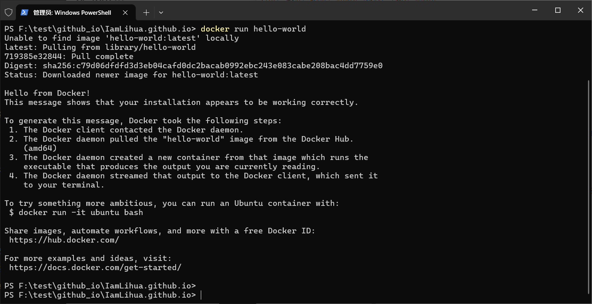
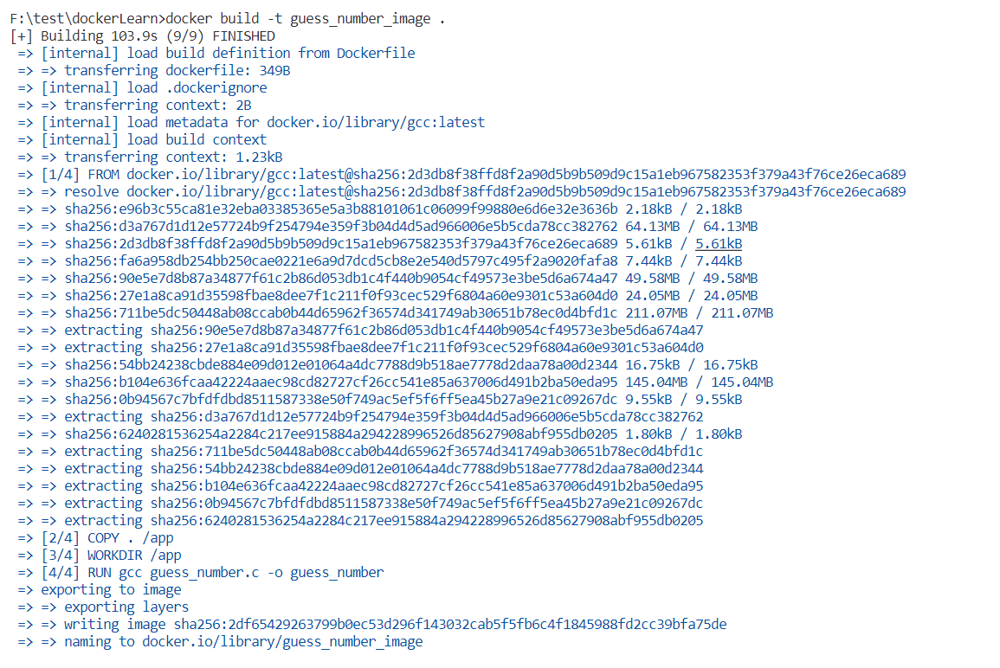
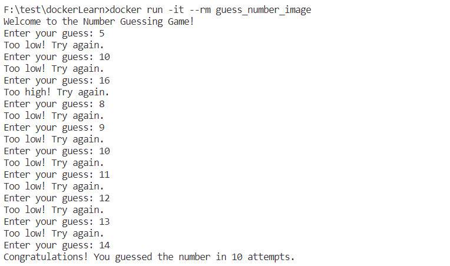
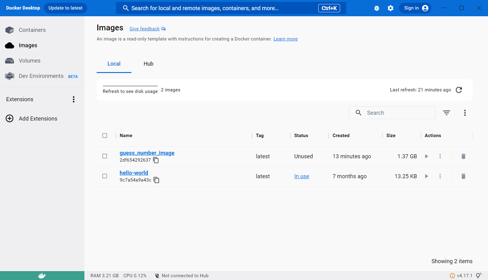
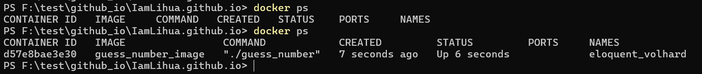
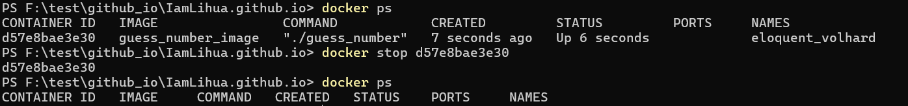
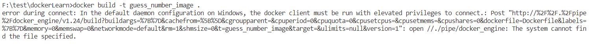
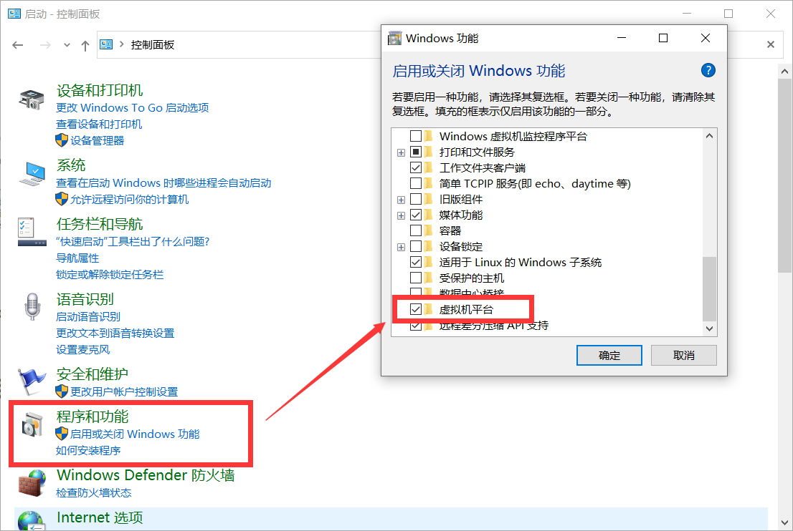

# Docker学习笔记

## 安装docker

去[Docker: Accelerated Container Application Development](https://www.docker.com/)安装docker

## 验证 Docker 安装

安装完成后，通过运行以下命令来验证 Docker 是否正确安装：

```bash
docker --version
docker run hello-world
```



## 用一个C语言的猜数字程序为例学习

### 创建 C 语言程序

创建一个简单的猜数字的 C 语言程序，比如 `guess_number.c`：

```c
#include <stdio.h>
#include <stdlib.h>
#include <time.h>

int main() {
    srand(time(0));
    int number_to_guess = rand() % 100;
    int guess, attempts = 0;

    printf("Welcome to the Number Guessing Game!\n");

    do {
        printf("Enter your guess: ");
        scanf("%d", &guess);
        attempts++;

        if (guess > number_to_guess) {
            printf("Too high! Try again.\n");
        } else if (guess < number_to_guess) {
            printf("Too low! Try again.\n");
        } else {
            printf("Congratulations! You guessed the number in %d attempts.\n", attempts);
        }
    } while (guess != number_to_guess);

    return 0;
}

```

### 创建 Dockerfile

在 C 语言程序的目录下创建一个名为 `Dockerfile` 的文件：

```dockerfile
# Dockerfile
FROM gcc:latest

# 这一行的作用是将当前目录（Docker 上下文中的当前目录，即包含 Dockerfile 的目录）中的所有文件和文件夹复制到容器中的 /app 目录中。
COPY . /app
WORKDIR /app

RUN gcc guess_number.c -o guess_number

CMD ["./guess_number"]

```

这个 Dockerfile 使用了 `gcc:latest` 镜像，将C 语言程序复制到容器中，并编译成可执行文件。最后，定义了容器启动时运行的命令。

### 构建 Docker 镜像

在包含 Dockerfile 的目录下运行以下命令：

```bash
docker build -t guess_number_image .
```



构建后当前文件夹下没有多出任何文件，应该是把镜像构建在**docker**指定的位置了

### 运行 Docker 容器

```bash
docker run -it --rm guess_number_image
```



其中 `-it` 选项表示使用交互模式，并分配一个终端，`--rm` 选项表示容器停止后自动删除。

### 查看Docker Desktop

此时猜数字程序已经退出



### 查看运行中的容器

再次打开猜数字程序，然后

```bash
docker ps
```



### 停止和删除容器

```bash
docker stop container_id
docker rm container_id
```



## 镜像与容器的区别

镜像是一个静态的、不可变的软件包，而容器是一个动态的、可变的运行实例。

镜像用于定义应用程序的静态结构，而容器用于在运行时执行和修改应用程序。

在实际应用中，通常通过镜像来创建容器，以便启动和运行应用程序。

## 遇到的问题

### 问题1：error during connect

在build时遇到

> error during connect: In the default daemon configuration on Windows, the docker client must be run with elevated privileges to connect



#### 解决方案

打开**docker desktop**

此时问题可以解决

### 问题2：请启用虚拟机平台 Windows 功能并确保在 BIOS 中启用虚拟化

使用**wsl**的时候遇到

在如下系统设置中勾中虚拟机平台，其实在**Windows**下用**docker**的比较少


