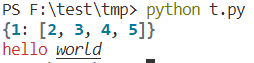
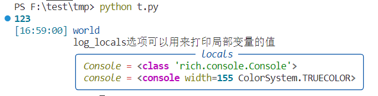
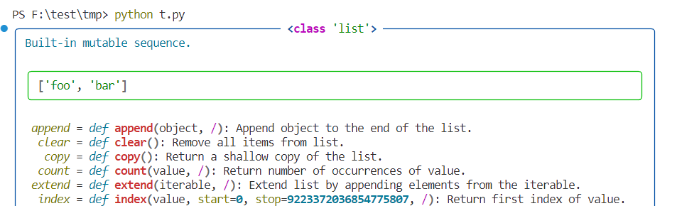
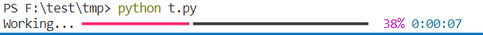
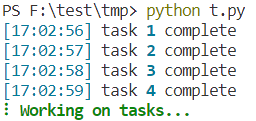

# python `rich`库笔记

[官网中文文档](https://github.com/textualize/rich/blob/master/README.cn.md)

## 预览

在命令行输入以下命令进行预览

```sh
python -m rich
```

## rich.print

这是一个导入即用的函数，它的参数与`python`自带的`print`函数一致

以下是一个示例：

```python
from rich import print

# rich的print会根据数据类型给打印的对象加上不同的颜色
print({1:[2,3,4,5]})
# 标签语法 输出红色的hello和斜体+下划线的world
print("[red]hello[/red] [i u]world[/i u]")

```



## rich.console.Console

这个比刚刚的`print`更高级一些

```python
from rich.console import Console

console = Console()
console.print(123) # 和之前的rich.print一样
# log会打印时间和所在行数
console.log('[blue]world[/blue]') # [16:34:39] world     t.py:4
console.log('log_locals选项可以用来打印局部变量的值',log_locals=True) # 不过还是觉得需要看什么变量就直接打印就行了
```



*图的右侧还有代码的行数，这里没有截到右边*

## rich.inspect

可以用来检查对应对象或者实例

```python
from rich import inspect

my_list = ["foo", "bar"]
# methods参数决定是否显示对应方法
inspect(my_list, methods=True)
# 当然你也可以查看它自己
inspect(inspect)
```



## rich.progress.track

打印无闪烁的进度条

```python
from rich.progress import track
import time

def do_step(arg):
    # print(arg)
    # 如果有打印的话 可以发现那个进度条永远是在最后的
    time.sleep(0.1)

for step in track(range(100)):
    do_step(step)
```



*进度条右侧的剩余时间是它自己估计的*

## rich.console.Console.status

对于那些很难计算进度的情况，你可以使用 status 方法，它会展示一个“环形旋转”的动画和文字信息。这个动画并不会妨碍你正常使用控制台。

```python
from time import sleep
from rich.console import Console

console = Console()
tasks = [f"task {n}" for n in range(1, 11)]

with console.status("[bold green]Working on tasks...") as status:
    while tasks:
        task = tasks.pop(0)
        sleep(1)
        console.log(f"{task} complete")
```



*这个小动画和前面的进度条不同，进度条结束了也会保留，而这个小动画结束之后会消失。*

## 其他

还有一些类似显示$Markdown$和语法高亮的功能，感觉挺实用的，以后要用的时候可以学一下
