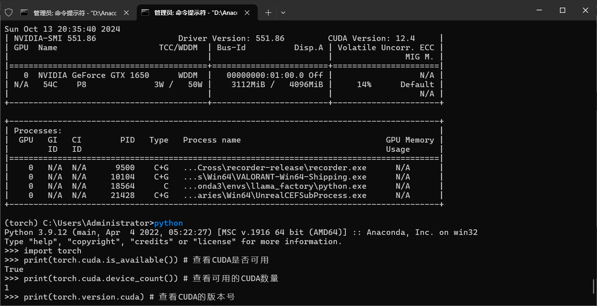

# gpu版torch安装

## 一般的教程

去[PyTorch](https://pytorch.org/)安装

## 一般的结果

只能装上cpu版的

## 原因

[为什么conda安装pytorch版本不对-CSDN博客](https://blog.csdn.net/u013468614/article/details/125910538)

## 解决方案

[torch和torchvision 版本对应_torch 2.4 对应的torchvision-CSDN博客](https://blog.csdn.net/gls_nuaa/article/details/142766618)

比如我的电脑的安装命令是

```sh
conda install pytorch==2.4.0 torchvision==0.19.0 torchaudio==2.4.0 pytorch-cuda=12.4 -c pytorch -c nvidia
```

## 注意点

- 现在装pytorch不需要专门去装cudnn和toolkit了

[记录 coda装pytorch并不需要单独装cuda和cudnn|李沐评论_torch需要提前装cuda吗-CSDN博客](https://blog.csdn.net/qq_54499870/article/details/127548163)

- cuda向前兼容，如12.4的`CUDA Version: 12.4`可以装11.6的`torch.version.cuda`



## 查看已经安装的软件包列表

```sh
conda list
pip list
```

