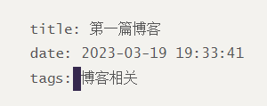

## 遇到问题

`npx hexo server`遇到报错：

```
ERROR {
  err: YAMLException: can not read a block mapping entry; a multiline key may not be an implicit key at line 4, column 1:
......
    reason: 'can not read a block mapping entry; a multiline key may not be an implicit key',
    mark: Mark {
      name: null,
      buffer: 'title: 第一篇博客\ndate: 2023-03-19 19:33:41\ntags:博客相关\n\x00',
      position: 49,
      line: 3,
      column: 0
    }
  }
} Process failed: %s _posts/第一篇博客.md
```

使用`hexo clean`也无法解决

## 解决方案

> title: 第一篇博客
> date: 2023-03-19 19:33:41
> tags: 博客相关

这是对应博客的开头，tags冒号后面缺少一个空格，加上就好了，如图：




## 如何在博客中插入图片

发现在md文档同目录下新建img文件夹再引用没有用，查到了这篇

[ 解决Hexo无法显示图片的几种方案-CSDN博客](https://blog.csdn.net/weixin_42030522/article/details/123075824)

将`post_asset_folder`赋值为true，并将图片放入md文件同名文件夹
