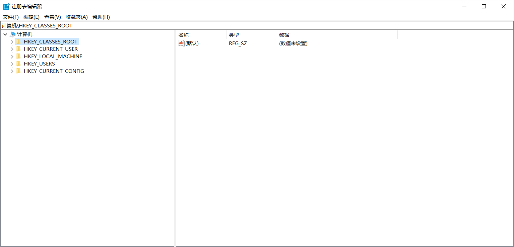
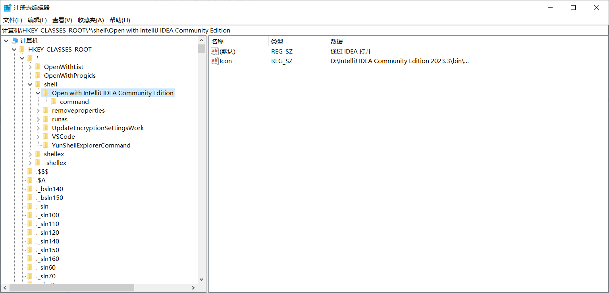
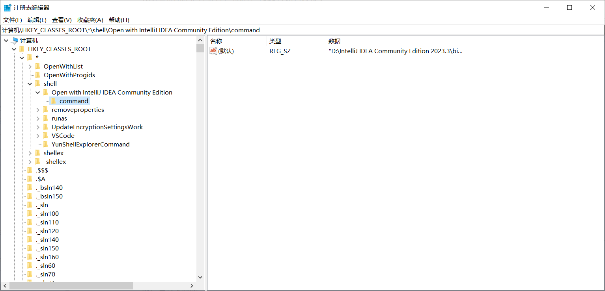
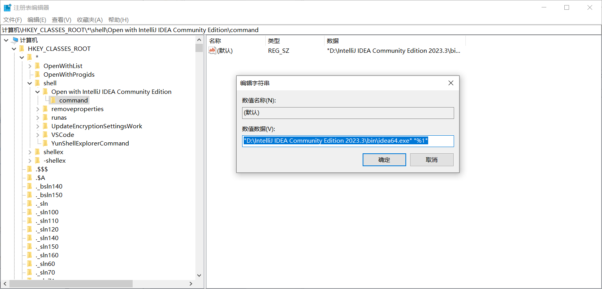
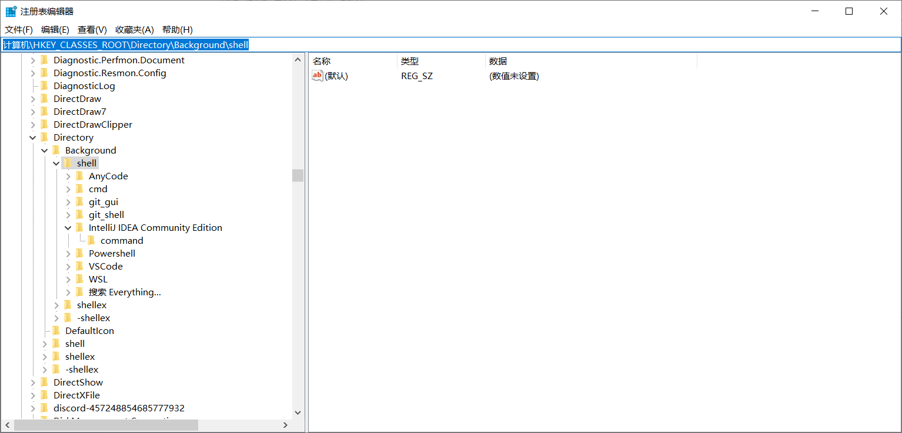
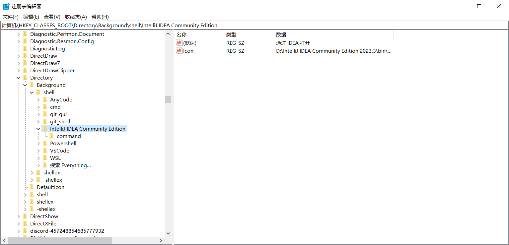
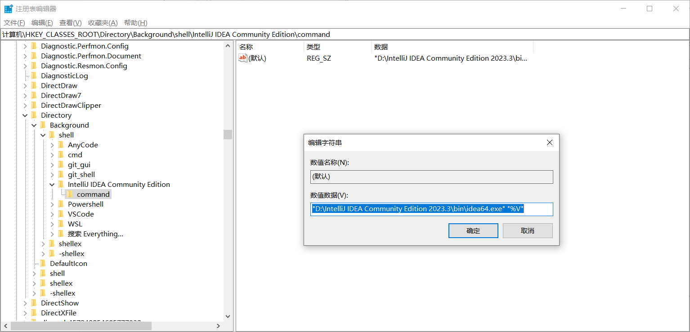
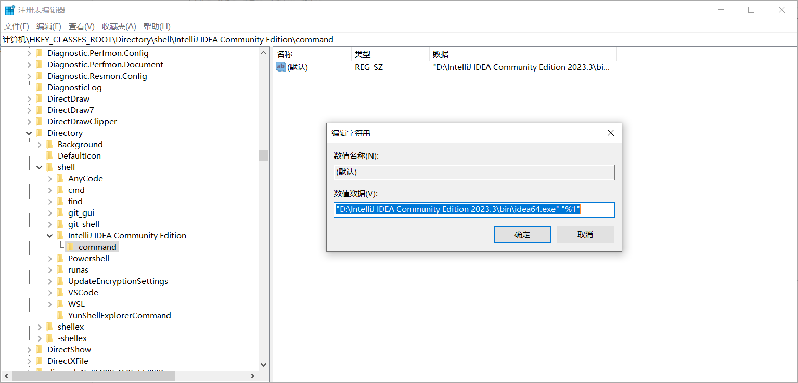
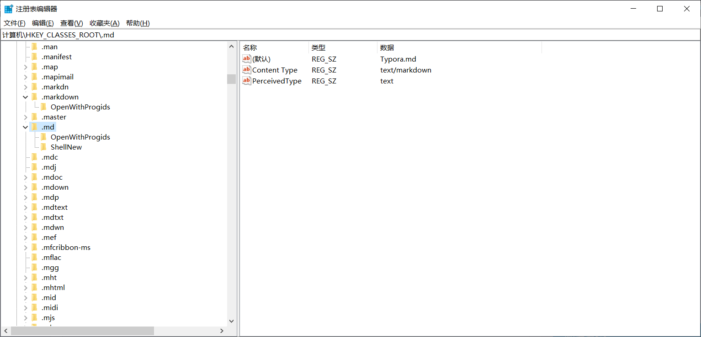

# 注册表笔记

有时候在文件上的右键菜单和在文件夹上的右键菜单不是很美观(刚从Eclipse转了IDEA，发现IDEA的右键菜单有点长)，想自定义一下，就有了这篇笔记

## 注册表编辑器

`Win+r`输入`regedit`打开注册表编辑器，接下来的操作要从这上面改



## 右键文件

到`计算机\HKEY_CLASSES_ROOT\*\shell`这个路径下



点击**Open with IntelliJ IDEA Community Edition**

它的键值对如右边所示，第一个是它的名称，第二个是它的图标路径，都可以改

然后是它下面的**command**



我们查看它的完整命令：



是用**idea64.exe**来打开输入的第一个参数`%1`(这里指的是点击的文件)，注意要用引号包围

## 右键文件夹背景

到路径`计算机\HKEY_CLASSES_ROOT\Directory\Background\shell`下



这里还是到**IntelliJ IDEA Community Edition**这里来



这两项和上面一样

看下面的**command**，发现参数变成了`%V`



注意这里修改的是右击文件夹背景的菜单，而不是直接右键文件夹的菜单

## 右键文件夹

直接右键文件夹的菜单的修改要到路径`计算机\HKEY_CLASSES_ROOT\Directory\shell`下，和上面的对比发现少一个**background**

还是老样子，基本都是类似的，不过注意到这里的命令参数变成了`%1`，因为这里是直接右键选中的文件夹



## 新建文件

通过`.reg`文件的新建文件可以参考[Typora添加右键新建Markdown文件 - 墨莲玦 - 博客园 (cnblogs.com)](https://www.cnblogs.com/zhoujiayingvana/p/12357812.html)

使用这样的`.reg`文件：

```c#
Windows Registry Editor Version 5.00

[HKEY_CLASSES_ROOT\.md]
@="Typora.md"
"Content Type"="text/markdown"
"PerceivedType"="text"

[HKEY_CLASSES_ROOT\.md\ShellNew]
"NullFile"=""

```

打开注册表后发现这一项比其他的多一个`ShellNew`


